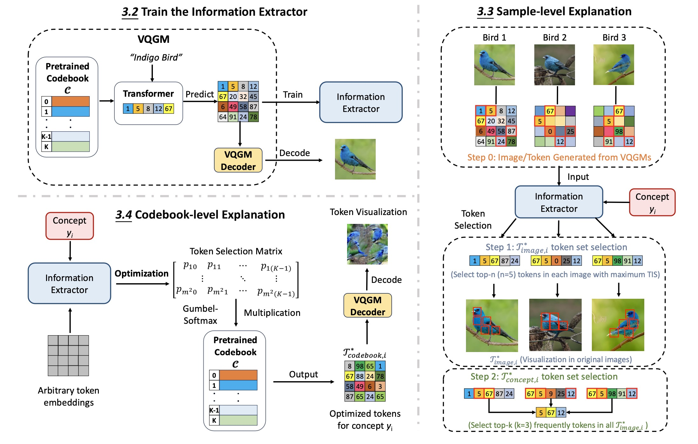

# CORTEX

## 📄 *Concept-Centric Token Interpretation for Vector-Quantized Generative Models*

**Tianze Yang†, Yucheng Shi†, Mengnan Du, Xuansheng Wu, Qiaoyu Tan, Jin Sun, Ninghao Liu**  
† Equal contribution


<p align="center">
  
</p>

<p align="center"><b>Figure:</b> Our pipeline for token-level concept interpretation.</p>
---

## 1. ⚙️ Environment

| Requirement | Value      |
| ----------- | ---------- |
| Python      | **3.12.3** |
| Conda env   | **CORTEX** |

### 1.1 Create the environment

```bash
# Option A (preferred): use the YAML file
conda env create -f environment.yml   # creates env named “CORTEX”

# Option B: use the requirements file
conda create -n CORTEX python=3.12.3
conda activate CORTEX
pip install -r requirements.txt
```

### 1.2 Activate
``` bash
conda activate CORTEX
```

---

## 2. 🗂 Repository Layout

```text
CORTEX
├── VQGAN_explanation/   # Experiments & analyses based on VQGAN
├── Dalle_explanation/   # Experiments & analyses based on DALLE
├── environment.yml      # Conda environment specification (preferred)
├── requirements.txt     # Pip fallback dependency list
└── README.md            # Repository overview (you are here)
```

---

## 3. 🔬 Experiments

### 3.1 🧠 VQGAN Experiments

```bash
cd VQGAN_explanation
```

This subfolder contains the implementation of CORTEX to explain the VQGAN model.

---

### 📁 Directory Structure

```
CORTEX/VQGAN_explanation/
├── checkpoints/            # Model checkpoints (download required)
├── datasets/               # Datasets (download required)
├── eval/                   # Evaluation scripts
│   ├── codebook_level_explanation.py
│   ├── sample_concept_level_explanation.py
│   ├── sample_image_level_explanation.py
├── explanation_evaluation/ # Evaluation metrics for explanations
├── logs/                   # Training logs
├── results/                # Results directory
├── taming/                 # VQGAN related modules
├── model.py                # IEM architecture
├── new_vqgan.py            # Prepare for the VQGAN repository
├── dataset.py              # Dataset loader
├── train.py                # Training script for IEM
├── test.py                 # Evaluation script
├── TIS_computation.py      # Token Importance Score computation
├── TIS_analysis.py         # TIS analysis for concept-level explanations
├── generate_freq_based_tokens.py # Generate frequency-based baseline
```

---

### ⚙️ Setup

1. Clone the repository of [VQGAN](https://github.com/CompVis/taming-transformers)
2. Place the `new_vqgan.py` file into the VQGAN repository under the `taming-transformers/taming/models` directory
3. Download the datasets or generate your own dataset and replace the `datasets` directory  
   (The dataset was generated using the [VQGAN](https://github.com/CompVis/taming-transformers) model.)
4. Download pre-trained checkpoints or train your own IEMs and place them in the `checkpoints` directory

> **📥 Data and Checkpoints Download:**  
> You can download our generated dataset from [Download Datasets](https://www.dropbox.com/scl/fo/5avmi5h6oexhs9s8hnsk7/AANF0nlI3PiNW5__F-yiQ-w?rlkey=yzw3aa47pzjepiccho1i6qy12&st=lkchy1qd&dl=0) and 
> Our pre-trained checkpoints from [Download Checkpoints](https://www.dropbox.com/scl/fi/i1agiqh2lxdan42k7gl3d/checkpoints.zip?rlkey=6803bhvvtrx7bl5isr8ps14qy&st=d4cx0w40&dl=0).

> ⚠️ *Note: The dataset is quite large. For efficiency, we recommend generating only the required subset for your task instead of downloading the entire dataset.*


---


### 🏋️‍♂️ 1. Training

You can train your own Interpretable Explanation Model (IEM) on different Vector-Quantized Generative Models (VQGMs).

#### 🔢 Input Format
The model input is a token-based embedding with shape **(256, 16, 16)**.
To train IEMs on other **Vector-Quantized Generative Models (VQGMs)**, you need to first generate the required dataset:

- For each image, save its **token-based embedding** (of shape `256 × 16 × 16`)
- During generation, record the corresponding **token indices** and **label**
- Save this metadata in a `.csv` file following the format of this [train_embeddings.csv](https://www.dropbox.com/scl/fi/srtuiapjabm0lsf25icm9/train_embeddings.csv?rlkey=qeb43dem1yw9fz69uz5816kya&st=g7klx62m&dl=0)

#### ▶️ Training Command
```bash
python train.py --model {model_name}
```

Where `model_name` ∈ {1, 2, 3, 4}.

---

### 🧪 2. Evaluation Preparation

#### 📊 2.1 Test IEM Classification Performance

```bash
python test.py --model {model_name}
```

#### 🎯 2.2 Compute Token Importance Scores (TIS)

```bash
python TIS_computation.py --model {model_name} --data_type {data_type} --batch_size {batch_size} --gpu {gpu_number}
```

- `model_name`: 1, 2, 3, or 4  
- `data_type`:  
  - `train`: for `eval/sample_concept_level_explanation.py`  
  - `test`: for `eval/sample_image_level_explanation.py`  
- `batch_size`: Integer value  
- `gpu_number`: GPU device index  

**Example:**
```bash
python TIS_computation.py --model 1 --data_type train --batch_size 25 --gpu 1
```

> ⚠️ This process may take considerable time depending on dataset and GPU.

#### 📈 2.3 Generate Frequency-based Baseline

```bash
python generate_freq_based_tokens.py
```

#### 🧠 2.4 Generate Sample Concept-level Tokens

```bash
python TIS_analysis.py --model {model_name}
```

---

### 🧵 3. Evaluation

#### 📂 3.1 Navigate to the Evaluation Directory

```bash
cd eval
```

#### 🖼️ 3.2 Sample Image-level Explanation

```bash
python sample_image_level_explanation.py --model {model_name}
```

#### 🧩 3.3 Sample Concept-level Explanation

```bash
python sample_concept_level_explanation.py --model {model_name} --top_n {top_n_value} --token_num {token_num}
```

- `top_n`: Select top-n tokens per image  
- `token_num`: Number of tokens to use

#### 🔍 3.4 Codebook-level Explanation

Replace the line inside `codebook_level_explanation.py`:
```python
VQGAN_directory = {Your VQGAN directory}
```
with your actual VQGAN repo path.

Run:
```bash
python codebook_level_explanation.py --model {model_name} --steps {optimization_steps} --lr {learning_rate} --optimization_type {token_selection or embedding}
```

**Example:**
```bash
python codebook_level_explanation.py --model 1 --optimization_type token
```

---
### 3.2 🧠 DALLE Experiments

```bash
cd Dalle_explanation
```

This subfolder contains the implementation of CORTEX to explain the DALL·E-mini model.

---

### 📁 Directory Structure

```
CORTEX/Dalle_explanation/
├── checkpoints/            # Model checkpoints (download required)
├── datasets/               # Datasets (download required)
├── bias_detection.py       # Bias detection using TIS
├── dataset.py              # Dataset loader
├── model.py                # IEM architecture
├── test.py                 # Evaluation script
├── train.py                # Training script for IEM
├── TIS_computation.py      # Token Importance Score computation
├── TIS_analysis.py         # TIS analysis
├── README.md               # Local instruction file
```

---

### ⚙️ Setup

1. Download the datasets generated by [DALL·E-mini](https://github.com/borisdayma/dalle-mini)  
   and replace the `datasets` directory.  
   > 📥 **Dataset Download:** [Datasets](https://www.dropbox.com/scl/fi/c4158jd7so3lo2kah86so/datasets.zip?rlkey=zm098bhx2s34bq0tjhxsomhrx&st=9xjq5i4z&dl=0)

2. Download the pre-trained checkpoints and place them in the `checkpoints` directory.  
   > 📥 **Checkpoints Download:** [Checkpoints](https://www.dropbox.com/scl/fi/kkj67aeo6wy8w1dh13hu5/checkpoints.zip?rlkey=1v7x73gfg3je303ybsv321368&st=mxp7swhu&dl=0)
> ⚠️ *Note: In this experiment, we only pretrained the CNN-based model; you can train the IEM with other structures*
---

### 🏋️‍♂️ 1. Training

You can train an Interpretable Explanation Model (IEM) on DALL·E-mini embeddings using:

```bash
python train.py --model 1
```

---

### 🧪 2. Evaluation Preparation

#### 📊 2.1 Test IEM Classification Accuracy

```bash
python test.py --model 1 --bias_type doctor_color  # or doctor_gender
```

#### 🔍 2.2 Compute Token Importance Scores (TIS)

```bash
python TIS_computation.py --model 1 --bias_type doctor_color  # or doctor_gender
```

#### 🧠 2.3 Analyze TIS Results

```bash
python TIS_analysis.py --model 1 --bias_type doctor_color  # or doctor_gender
```

#### 🧯 2.4 Bias Token Detection

```bash
python bias_detection.py --model 1 --bias_type doctor_color --top_n 10 --token_num 10
# or use doctor_gender
```

---

### 📜 License

This project is licensed under the **Apache License 2.0**.  
You may use, modify, and distribute this code under the terms of the license.

For full license details, please refer to the [LICENSE](https://www.apache.org/licenses/LICENSE-2.0.txt) file included in the repository.
